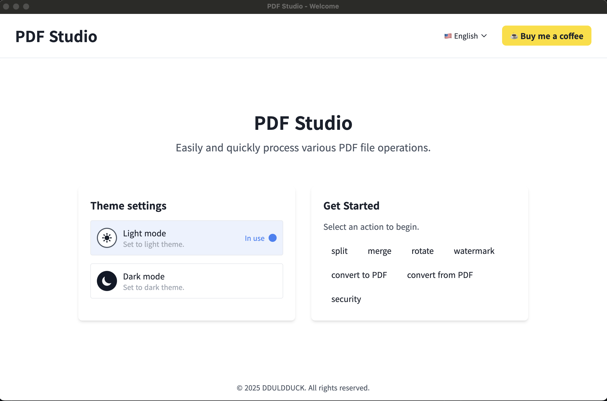
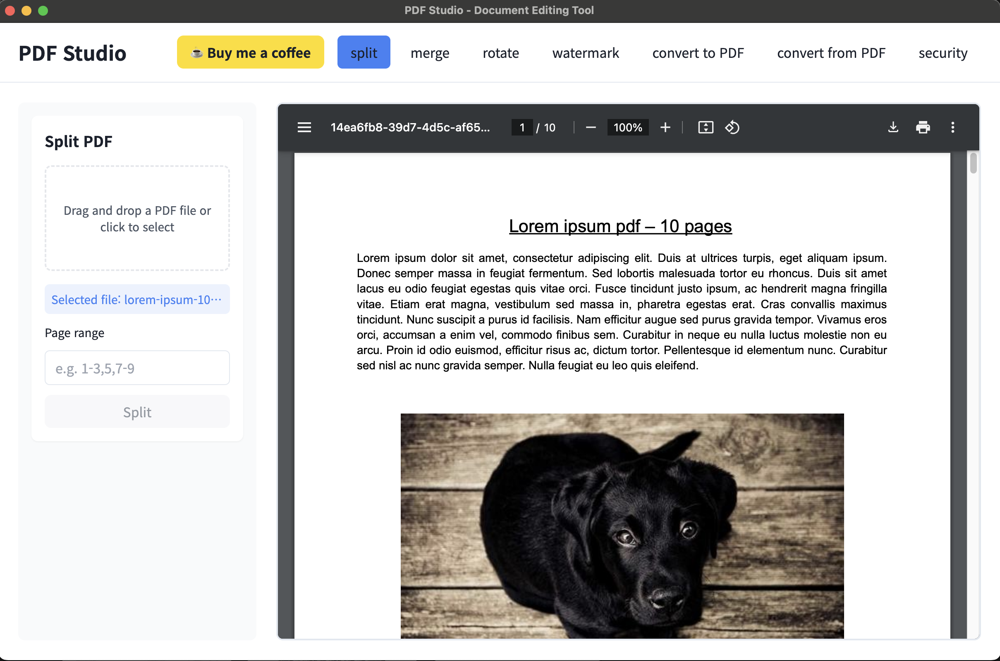

# 🎉 PDF Studio v1.1.0 출시!

안녕하세요! PDF 문서 작업을 위한 새로운 솔루션, **PDF Studio**의 첫 번째 정식 버전을 드디어 선보입니다. 복잡하고 번거로웠던 PDF 편집, 이제 PDF Studio와 함께라면 간편해집니다.

PDF Studio는 일상적인 문서 작업부터 전문적인 편집까지, 필요한 모든 기능을 담은 강력한 데스크톱 애플리케이션입니다.

## ✨ 주요 기능 (Key Features)

이번 첫 출시 버전에서는 다음과 같은 핵심 기능들을 만나보실 수 있습니다.

*   **📄 문서 분할 (Split):**
    *   거대한 PDF 파일을 원하는 페이지 범위나 특정 페이지 번호로 손쉽게 분할하세요.
    *   클릭 몇 번만으로 필요한 부분만 따로 저장할 수 있습니다.

*   **➕ 문서 병합 (Merge):**
    *   여러 개의 PDF 문서를 드래그 앤 드롭으로 간편하게 하나의 파일로 합칠 수 있습니다.
    *   보고서, 계약서 등 흩어져 있는 자료를 깔끔하게 정리해 보세요.

*   **💧 워터마크 추가 (Watermark):**
    *   텍스트나 이미지 워터마크를 추가하여 문서의 저작권을 보호하거나 출처를 명시할 수 있습니다.
    *   워터마크의 투명도, 위치, 크기를 자유롭게 조절하여 전문적인 문서를 완성하세요.

*   **🔄 페이지 회전 및 순서 변경 (Rotate & Reorder):**
    *   잘못 스캔된 페이지를 바로잡거나, 원하는 순서대로 페이지를 재배열할 수 있습니다.
    *   직관적인 인터페이스로 문서의 흐름을 완벽하게 제어하세요.

## 💻 기술 스택 (Tech Stack)

PDF Studio는 최신 기술을 바탕으로 최고의 성능과 안정성을 제공합니다.

*   **프론트엔드 (Frontend):** **Nextron (Next.js + Electron)**을 사용하여 매끄럽고 반응성이 뛰어난 사용자 인터페이스를 구현했습니다.
*   **백엔드 (Backend):** 핵심적인 PDF 처리 기능은 강력하고 안정적인 **Python** 백엔드에서 담당하여 복잡한 작업도 신속하게 처리합니다.

**PDF Studio와 함께해주셔서 감사합니다!**

***

# 🎉 Announcing PDF Studio v1.1.0!

Hello everyone! We are thrilled to unveil the first official version of **PDF Studio**, your new solution for working with PDF documents. Complex and tedious PDF editing is now a thing of the past—with PDF Studio, it's simple and efficient.

PDF Studio is a powerful desktop application packed with all the essential features you need, from everyday document tasks to professional-level editing.

## ✨ Key Features

In this initial release, you can explore the following core features:

*   **📄 Split:**
    *   Easily split large PDF files by a specific page range or individual page numbers.
    *   Extract and save only the parts you need with just a few clicks.

*   **➕ Merge:**
    *   Effortlessly combine multiple PDF documents into a single file with a simple drag-and-drop.
    *   Organize your scattered documents, such as reports and contracts, into one clean file.

*   **💧 Watermark:**
    *   Protect your documents or indicate their origin by adding custom text or image watermarks.
    *   Freely adjust the opacity, position, and size of your watermark to create professional-looking documents.

*   **🔄 Rotate & Reorder:**
    *   Fix improperly scanned pages or rearrange them in your desired order.
    *   Take full control of your document's flow with our intuitive interface.

## 💻 Tech Stack

PDF Studio is built on modern technologies to deliver top-tier performance and stability.

*   **Frontend:** Built with **Nextron (Next.js + Electron)** for a seamless and responsive user experience.
*   **Backend:** The core PDF processing is powered by a robust and reliable **Python** backend, ensuring swift handling of even complex operations.

**Thank you for using PDF Studio!**

## 📺 데모 미디어 (Demo Media)

### 이미지 (IMAGE)
- 홈 이미지 (Home)
  

- 분할 기능 예시 (Split) 
  

### 동영상 (MOVIE)
- PDF Studio 사용 예시 (Demo video)


## 다운로드 (Download)
- 윈도우 와 Mac 지원 ( Window and Mac )
- Window : exe
- Mac : dmg
- https://github.com/DDULDDUCK/pdf-studio/releases
***

# PDF-Studio

> Nextron(Electron + Next.js) 기반의 PDF 도구 데스크탑 애플리케이션입니다. TailwindCSS, Python 백엔드, 다양한 PDF 기능을 제공합니다.

---

## 프로젝트 구조

```
PDF-Studio/
├── app/           # Electron 앱 리소스(HTML, preload, background 등)
├── backend/       # Python PDF 처리 백엔드
├── main/          # Electron 메인 프로세스 (TypeScript)
├── renderer/      # Next.js 프론트엔드 (React, TypeScript)
├── resources/     # 앱 아이콘 등 리소스
├── scripts/       # 개발/배포용 스크립트
├── package.json   # Node/Electron 패키지 설정
└── ...
```

## 설치 및 실행

### 1. 의존성 설치

```bash
# Node.js 패키지 설치 (루트에서)
npm install

# 또는 yarn
# yarn

# Python 백엔드 의존성 설치
cd backend
pip install -r requirements.txt
cd ..
```

### 2. 개발 모드 실행

```bash
# 프론트+Electron 개발 서버 실행
npm run dev
# 또는 yarn dev
```

### 3. 백엔드 빌드 (선택)

```bash
cd backend
# 빌드 스크립트 또는 pyinstaller 등 사용
# 예시: python -m PyInstaller pdf_processor.spec
cd ..
```

### 4. 프로덕션 빌드

```bash
npm run build
# 또는 yarn build
```

## 주요 스크립트

- `scripts/setup_mac_poppler.sh`: macOS용 poppler 설치
- `scripts/build_backend.js`: 백엔드 빌드 자동화

## 참고

- Electron, Next.js, TailwindCSS, Python 연동 프로젝트
- 환경에 따라 Python, Node.js, Electron, poppler 등이 필요할 수 있습니다.
